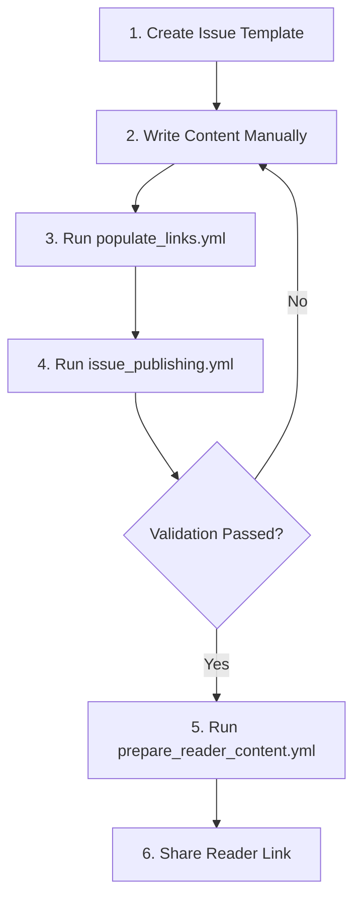

# GitHub Workflows Documentation

This directory contains automated workflows for the Vitals & Variables newsletter publishing process.

## Workflow Overview

### 1. 📝 `create_issue_template.yml` - Start Here for New Issues
**Purpose**: Creates the complete directory structure and templates for a new newsletter issue.

**When to use**: At the beginning of creating a new issue.

**Usage**:
```bash
# Go to Actions tab > Create New Issue Template > Run workflow
# Input: issue_number (e.g., "02")
# Input: issue_title (e.g., "nurse_staffing_optimization")
# Input: issue_description (optional)
```

**What it does**:
- Creates all required directories (01-06 blueprint stages)
- Generates README template with the 6-stage structure
- Creates code and toolkit templates
- Sets up placeholder content

### 2. 🔗 `populate_links.yml` - Auto-Fill Links
**Purpose**: Automatically populates all links and URLs throughout your content.

**When to use**: After writing your content but before publishing.

**Usage**:
```bash
# Go to Actions tab > Auto-Populate Content Links > Run workflow
# Input: issue_number (e.g., "01")
```

**What it does**:
- Replaces placeholders like `{{REPO_URL}}`, `{{TOOLKIT_URL}}`
- Auto-links relative file references
- Adds footer with resource links
- Creates a `LINKS.md` reference file with all URLs

### 3. ✅ `issue_publishing.yml` - Validate Content
**Purpose**: Validates that your issue meets all quality standards.

**When to use**: When you're ready to publish.

**Triggers**:
- Automatically on push to `issues/**/README.md`
- Manually via workflow dispatch

**What it checks**:
- Directory structure completeness
- Word count (600-800 words)
- Asset availability
- Link validity
- Spelling and markdown formatting

### 4. 📦 `prepare_reader_content.yml` - Create Shareable Version
**Purpose**: Creates a clean, reader-friendly version of your content.

**When to use**: After validation, when ready to share with readers.

**Usage**:
```bash
# Go to Actions tab > Prepare Reader-Facing Content > Run workflow
# Input: issue_number (e.g., "01")
```

**What it does**:
- Creates a separate branch with only reader-facing content
- Removes internal files and drafts
- Generates a reader-friendly README
- Provides a shareable GitHub link

## Recommended Publishing Flow



## Manual Steps Between Workflows

1. **After creating template**: Write your content in the generated README.md
2. **Before publishing**: Review the populated links
3. **After validation**: Copy key content for LinkedIn newsletter
4. **After reader prep**: Share the reader branch link

## Link Placeholders Available

Use these in your content - they'll be auto-replaced:

- `{{REPO_URL}}` - Main repository URL
- `{{ISSUE_URL}}` - Current issue directory
- `{{TOOLKIT_URL}}` - Toolkit subdirectory
- `{{CODE_URL}}` - Code subdirectory
- `{{ASSETS_URL}}` - Assets/grab-and-go directory
- `{{LINKEDIN_NEWSLETTER}}` - Newsletter subscription link
- `{{READER_BRANCH}}` - Clean reader version URL

## Tips for Success

1. **Start Early**: Use `create_issue_template.yml` as soon as you pick a topic
2. **Write Freely**: Don't worry about links while writing - automation handles it
3. **Validate Often**: Run publishing workflow to catch issues early
4. **Keep Reader Focus**: The reader branch excludes internal/draft content automatically

## Customization

All workflows can be customized by editing the YAML files. Key areas:

- **Validation rules**: Edit `issue_publishing.yml` checks
- **Link patterns**: Modify `populate_links.yml` Python script
- **Reader content**: Adjust what's included in `prepare_reader_content.yml`
- **Templates**: Update templates in `create_issue_template.yml`